# 部落格

這是一個力求簡潔美感的部落格，使用Nextjs搭建，你的星星是我最大的鼓勵

如果有任何可以改進的地方，歡迎來到我的部落格留言或是提交issue

部落格地址：https://mycoderland.tw

前台源碼：https://github.com/louis61619/blog-frontstage.git

後台源碼：https://github.com/louis61619/blog-backstage.git

服務端源碼：https://github.com/louis61619/blog-server.git


## 技術棧

以下列出主要使用的框架和庫

- Next.js
- Next-auth
- React-redux
- Immutable
- Ant-design
- Styled-components
- marked
- Highlight.js
- axios

[查看Next.js使用插件的採坑](https://www.mycoderland.tw/detail/16)


## 開發環境搭建

> 由於本項目是採用前後端分離，所以需要同時下載前後端的部分，項目中提供了一組FB登錄API的測試權杖

- 下載nodejs，nodejs版本需大於13，推薦使用yarn取代npm

- 下載本項目後端 : https://github.com/louis61619/blog-server

- 資料庫使用mysql

  - 如果要使用本地mysql，請匯入後端項目內的sql資料，具體步驟如下:
    - 創建資料庫並命名為react_blog
    - 設定mysql端口為3310
    - 匯入資料，該檔案位於/react-blog02.sql
    - 如果要修改設定參數請參閱
  - 如果不想使用本地mysql 可以使用docker，只要下指令**dokcer -d -p 3310:3306 louis61619/blog-data**即可運行該鏡像
    - 如果想要修改對外端口，可以直接修改 3310這個參數
    - 如果想要掛載volume，可以在指令中加入 -v <本地目錄>:/var/lib/mysql

- 啟用後端API

  ```
  yarn install && yarn dev
  ```

- 如果想要在開發環境中瀏覽部落格，請下載blog前台 https://github.com/louis61619/blog-frontstage.git，然後在根目錄下指令(默認啟用端口為3000)

  ```
  yarn install && yarn start
  ```

- 如果想要在開發環境中編輯部落格內容，請下載blog後台 https://github.com/louis61619/blog-backstage.git，然後在根目錄下指令(默認啟用端口為3001)

  ```
  yarn install && yarn dev
  ```

  

## 環境變量

位於根目錄 .env

| Keys                   | Introduction          |
| ---------------------- | --------------------- |
| NEXT_PUBLIC_URL        | 服務端URL             |
| NEXT_PUBLIC_STATIC     | 圖片地址前綴          |
| NEXTAUTH_URL           | 頁面開啟URL           |
| NEXTAUTH_TOKEN         | 權限驗證的加密字串    |
| FACEBOOK_CLIENT_ID     | Facebook 登錄API ID   |
| FACEBOOK_CLIENT_SECRET | Facebook 登錄API 密鑰 |
| GOOGLE_CLIENT_ID       | Google 登錄API ID     |
| GOOGLE_CLIENT_SECRET   | Google 登錄API 密鑰   |


## 功能

> v1.0

- [Progressive Web Apps](https://web.dev/progressive-web-apps/)
- [Responsive Web Design](https://zh.wikipedia.org/zh-tw/响应式网页设计)
- 第三方登錄
- 主要頁面: 
  - 首頁
  - 搜索
  - 文章
  - 詳情
  - 用戶


## 頁面介紹

>  首頁 

- 頂部推薦 (透過點擊數量判斷)
- 文章列表
- 博主訊息

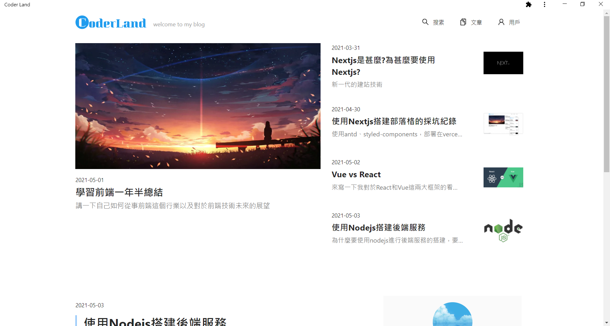


> 搜索頁

- 文章標題模糊查詢
- 文章標籤模糊查詢
- 標籤列表

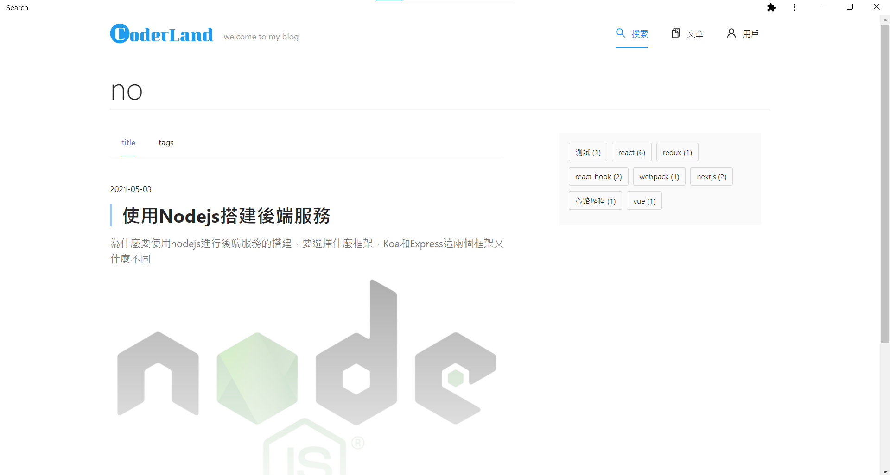

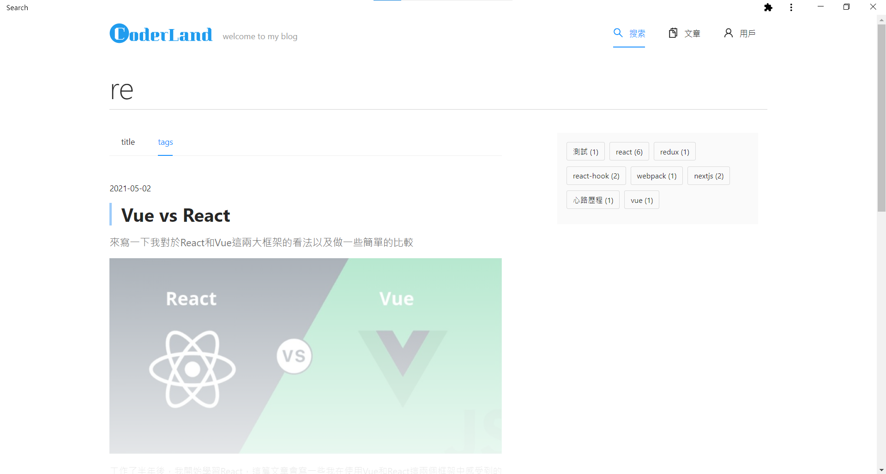

> 文章

- 文章列表
- 標籤列表

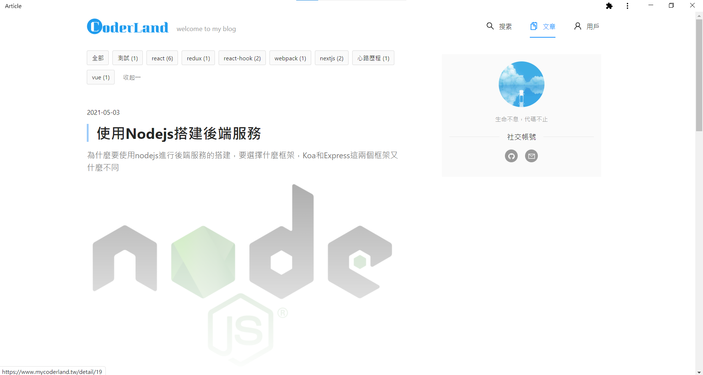


>  詳情

- 文章內容
- 文章目錄
- 底部推薦
- 留言

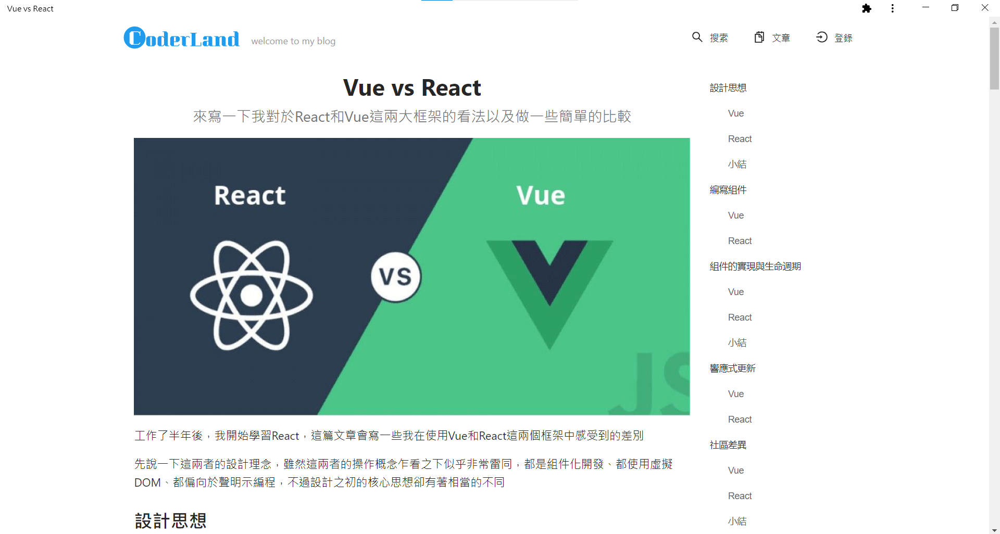

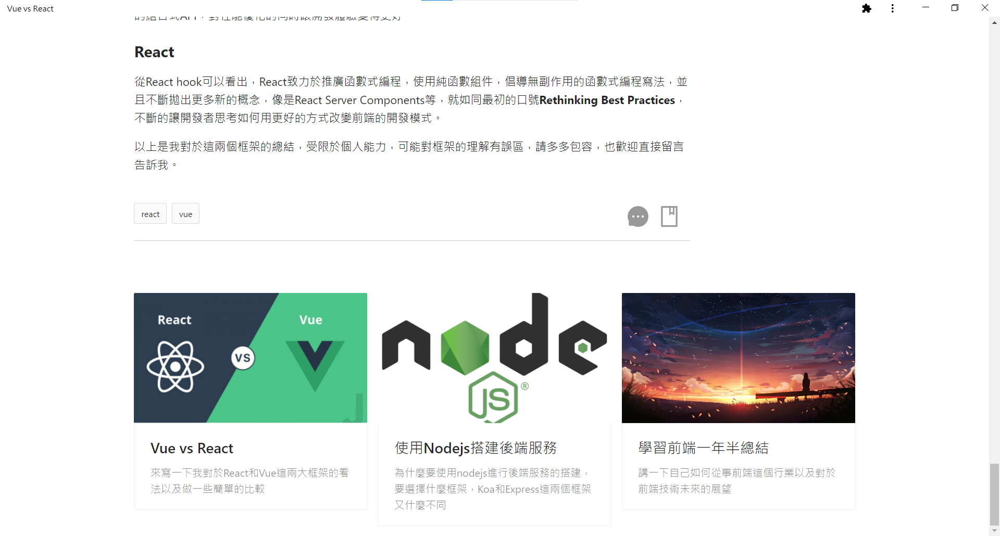

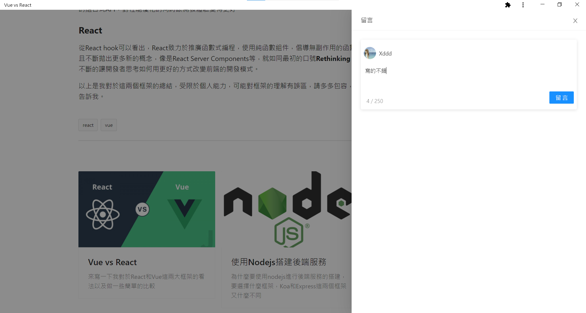

> 用戶

- 第三方登錄
- 收藏
- 通知
- 修改個人資料

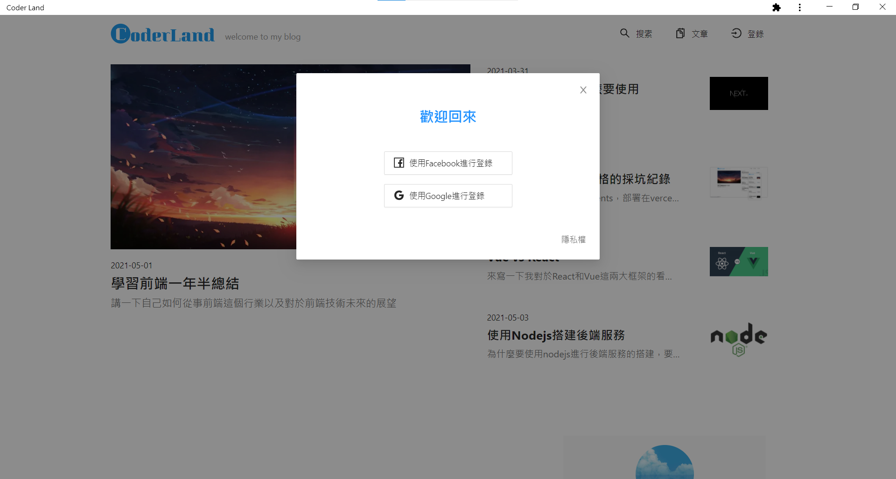


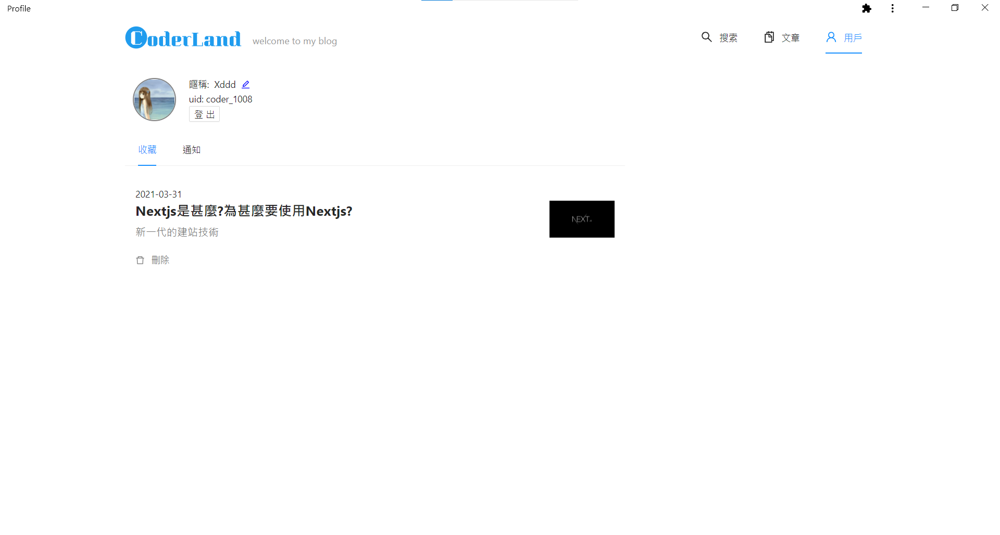

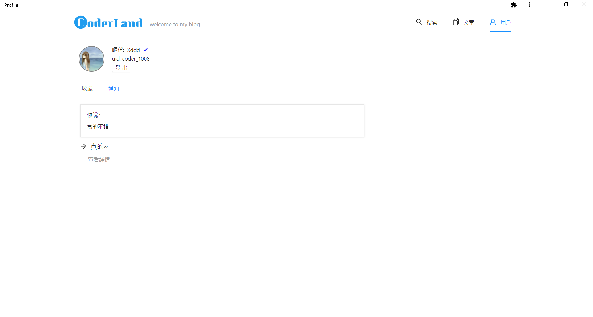

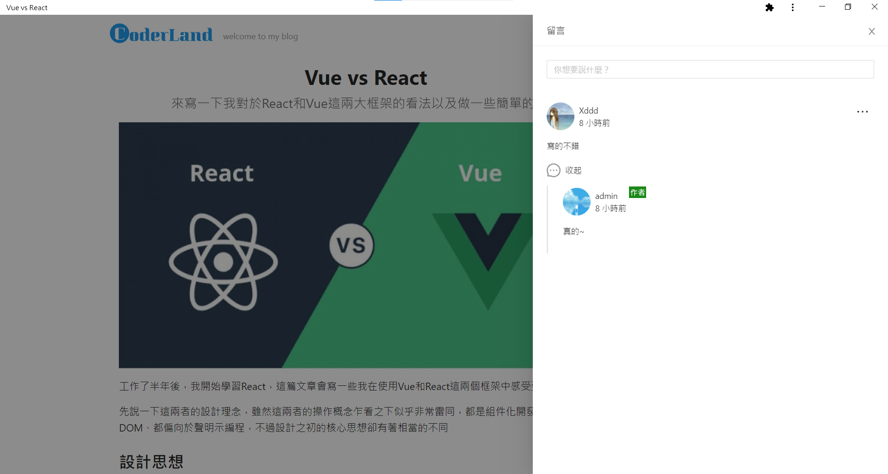

