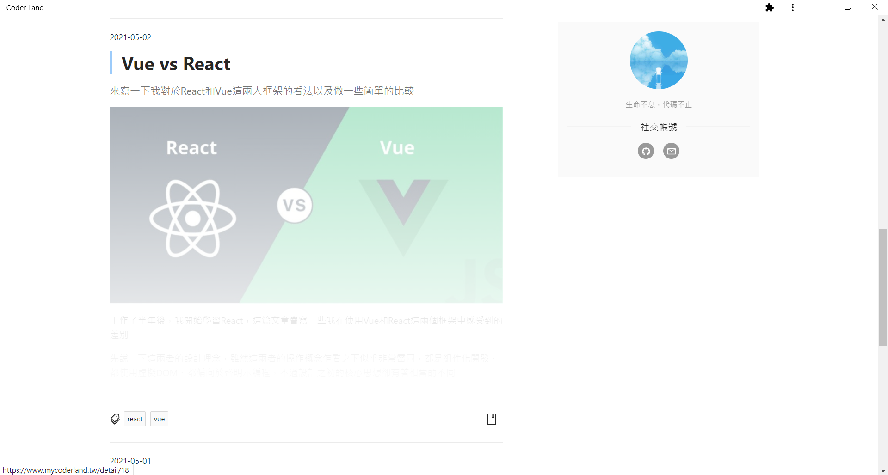

# 部落格

這是一個部落格練習項目

前台程式碼：https://github.com/louis61619/blog-frontstage.git

後台程式碼：https://github.com/louis61619/blog-backstage.git

服務端程式碼：https://github.com/louis61619/blog-server.git

## 使用技術

以下列出主要使用的框架和庫

- Next.js
- Next-auth
- React-redux
- Immutable
- Ant-design
- Styled-components
- marked
- Highlight.js
- axios

## 開發環境搭建

- 下載 nodejs，nodejs 版本需大於 13
- 下載前後台和服務端程式碼，然後在各自的資料夾執行

```
npm i && npm run dev
```

- 資料庫使用 mysql，預設讀取端口為 3310

  - 匯入項目內的 blog-data-sample.sql 資料
  - 如遇到 `Client does not support authentication protocol requested by server;` 錯誤，可以參考：https://stackoverflow.com/questions/50093144/mysql-8-0-client-does-not-support-authentication-protocol-requested-by-server
  
## 環境變量

位於根目錄 .env

| Keys                   | Introduction           |
| ---------------------- | ---------------------- |
| NEXT_PUBLIC_URL        | 服務端 URL             |
| NEXT_PUBLIC_STATIC     | 圖片地址前綴           |
| NEXTAUTH_URL           | 頁面開啟 URL           |
| NEXTAUTH_TOKEN         | 權限驗證的加密字串     |
| FACEBOOK_CLIENT_ID     | Facebook 登錄 API ID   |
| FACEBOOK_CLIENT_SECRET | Facebook 登錄 API 密鑰 |
| GOOGLE_CLIENT_ID       | Google 登錄 API ID     |
| GOOGLE_CLIENT_SECRET   | Google 登錄 API 密鑰   |

## 功能

- [Responsive Web Design](https://zh.wikipedia.org/zh-tw/响应式网页设计)
- 第三方登錄
- 主要頁面:
  - 首頁
  - 搜索
  - 文章
  - 詳情
  - 用戶

## 頁面介紹

> 首頁

- 頂部推薦 (透過點擊數量判斷)
- 文章列表
- 博主訊息




> 搜索頁

- 文章標題模糊查詢
- 文章標籤模糊查詢
- 標籤列表


> 文章

- 文章列表
- 標籤列表


> 詳情

- 文章內容
- 文章目錄
- 底部推薦
- 留言


> 用戶

- 第三方登錄
- 收藏
- 通知
- 修改個人資料


